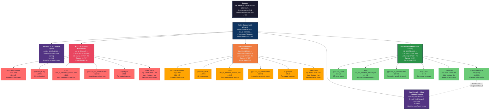

# nTop Model Lineage — Group3 UAS Wing

```mermaid
graph TD
    %% ── System ──
    SYS["<b>System: AI_Native_CAD_with_nTop</b><br/>d95972ef-...<br/><i>Dynamically run CAD alongside other tools with nTop</i>"]

    %% ── Top-level Model ──
    SYS --> MODEL

    MODEL["<b>Model: Group3-UAS-Wing-v8</b><br/>model_id: 063a1593-...<br/>file_id: 0ddff035-...<br/><i>Parametric nTop wing model for Group3 UAS</i>"]

    %% ── Two formal revisions ──
    MODEL --> REV1
    MODEL --> REV2

    REV1["<b>Revision v1 — Original Upload</b><br/>revision_id: 17a82381-...<br/>Group3-UAS-Wing-v8 (2).ntop<br/>34.2 MB<br/><i>Baseline wing geometry</i>"]

    REV2["<b>Revision v2 — High-Endurance Wing</b><br/>revision_id: b2b350a4-...<br/>Group3-UAS-Wing-v8-run3.ntop<br/>30.2 MB<br/><i>Updated from Run 3 output</i>"]

    %% ── Three nTop Runs ──
    MODEL --> RUN1
    MODEL --> RUN2
    MODEL --> RUN3

    RUN1["<b>Run 1 — Original Parameters</b><br/>job_id: 561c4e0f-...<br/>LOA 99.9in · Span 144in<br/>LE Sweep 46°/46° · TE Sweep -46°/15°<br/>Panel Break 0.30"]

    RUN2["<b>Run 2 — Modified Parameters</b><br/>job_id: 81154161-...<br/>LOA 78in · Span 150in<br/>LE Sweep 55°/35° · TE Sweep -30°/25°<br/>Panel Break 0.45"]

    RUN3["<b>Run 3 — High-Endurance Config</b><br/>job_id: 073cb526-...<br/>LOA 115in · Span 168in<br/>LE Sweep 30°/20° · TE Sweep -20°/5°<br/>Panel Break 0.55"]

    %% ── Run 1 Artifacts ──
    RUN1 --> R1_NTOP["Group3-UAS-Wing-v8(2).ntop<br/>30.9 MB<br/><i>Updated nTop model</i>"]
    RUN1 --> R1_OBJ["grp3-uas_v6.obj<br/>5.6 MB<br/><i>3D mesh output</i>"]
    RUN1 --> R1_METRICS["grp3-uas_v6_aerodeck_metrics.json<br/>4.3 KB<br/><i>Aero performance metrics</i>"]
    RUN1 --> R1_AERODECK["grp3-uas_v6_aerodeck.html<br/>122 KB<br/><i>Interactive aerodeck report</i>"]
    RUN1 --> R1_OUTPUT["output.json<br/>349 B<br/><i>Run output summary</i>"]
    RUN1 --> R1_VIEWS["7 view PNGs<br/>top · front · back · left<br/>right · bottom · iso<br/><i>Rendered wing views</i>"]

    %% ── Run 2 Artifacts ──
    RUN2 --> R2_NTOP["Group3-UAS-Wing-v8(2).ntop<br/>30.2 MB<br/><i>Updated nTop model</i>"]
    RUN2 --> R2_OBJ["grp3-uas_v6.obj<br/>4.9 MB<br/><i>3D mesh output</i>"]
    RUN2 --> R2_METRICS["grp3-uas_v6_aerodeck_metrics.json<br/>4.3 KB<br/><i>Aero performance metrics</i>"]
    RUN2 --> R2_AERODECK["grp3-uas_v6_aerodeck.html<br/>122 KB<br/><i>Interactive aerodeck report</i>"]
    RUN2 --> R2_OUTPUT["output.json<br/>345 B<br/><i>Run output summary</i>"]
    RUN2 --> R2_VIEWS["7 view PNGs<br/>top · front · back · left<br/>right · bottom · iso<br/><i>Rendered wing views</i>"]

    %% ── Run 3 Artifacts ──
    RUN3 --> R3_NTOP["Group3-UAS-Wing-v8(2).ntop<br/>30.2 MB<br/><i>Updated nTop model</i>"]
    RUN3 --> R3_OBJ["grp3-uas_v6.obj<br/>4.8 MB<br/><i>3D mesh output</i>"]
    RUN3 --> R3_METRICS["grp3-uas_v6_aerodeck_metrics.json<br/>4.3 KB<br/><i>Aero performance metrics</i>"]
    RUN3 --> R3_AERODECK["grp3-uas_v6_aerodeck.html<br/>122 KB<br/><i>Interactive aerodeck report</i>"]
    RUN3 --> R3_OUTPUT["output.json<br/>347 B<br/><i>Run output summary</i>"]
    RUN3 --> R3_VIEWS["7 view PNGs<br/>top · front · back · left<br/>right · bottom · iso<br/><i>Rendered wing views</i>"]

    %% ── Run 3 output fed back as v2 ──
    R3_NTOP -.->|"downloaded &<br/>re-uploaded as v2"| REV2

    %% ── Styling ──
    classDef system fill:#1a1a2e,stroke:#16213e,color:#e8e8e8,stroke-width:2px
    classDef model fill:#0f3460,stroke:#16213e,color:#e8e8e8,stroke-width:3px
    classDef revision fill:#533483,stroke:#16213e,color:#e8e8e8,stroke-width:2px
    classDef run1 fill:#e94560,stroke:#16213e,color:#e8e8e8,stroke-width:2px
    classDef run2 fill:#f07b3f,stroke:#16213e,color:#e8e8e8,stroke-width:2px
    classDef run3 fill:#2b9348,stroke:#16213e,color:#e8e8e8,stroke-width:2px
    classDef artifact1 fill:#ff6b6b,stroke:#c0392b,color:#1a1a2e,stroke-width:1px
    classDef artifact2 fill:#ffa502,stroke:#e67e22,color:#1a1a2e,stroke-width:1px
    classDef artifact3 fill:#6bcb77,stroke:#27ae60,color:#1a1a2e,stroke-width:1px

    class SYS system
    class MODEL model
    class REV1,REV2 revision
    class RUN1 run1
    class RUN2 run2
    class RUN3 run3
    class R1_NTOP,R1_OBJ,R1_METRICS,R1_AERODECK,R1_OUTPUT,R1_VIEWS artifact1
    class R2_NTOP,R2_OBJ,R2_METRICS,R2_AERODECK,R2_OUTPUT,R2_VIEWS artifact2
    class R3_NTOP,R3_OBJ,R3_METRICS,R3_AERODECK,R3_OUTPUT,R3_VIEWS artifact3
```
